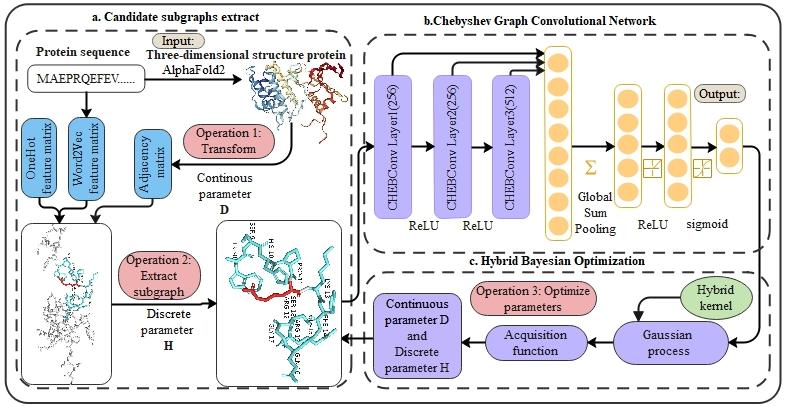
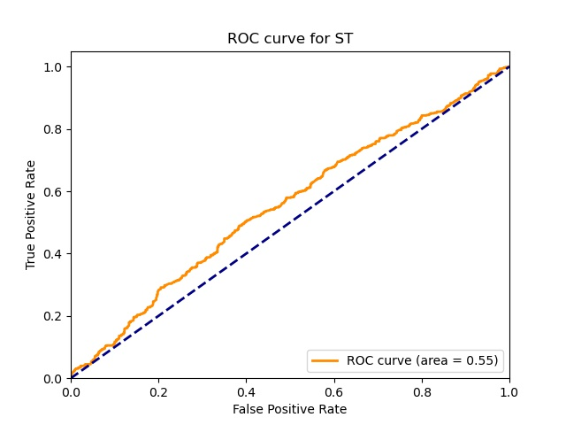

# **GraphMethySite**

Deep learning with protein methylation

What GraphMethySite can do:
1.  Exploit three-dimensional structural proteins to predict methylation sites.
2.  Predict protein methylation sites through the graph structures
3.  Apply Bayesian Optimization(BO) to select the best graph structure in order to improve predictive accuracy.




## Installation: (Conda highly recommended) 

GraphMethySite is tested to work under Python 3.8. The environment provided is `./doc/GCN.yml` and you can install through the script or you can install the following dependencies.

```shell
conda env create -f graphmethysite.yml
```

- Alternative install:

```shell
conda create -n graphmethysite python=3.8
source activate graphmethysite
conda install -c conda-forge bayesian-optimization
conda install numpy==1.23.1 pandas==1.3.4 scipy==1.4.1 matplotlib==3.4.3
conda install -c conda-forge biopython cudatoolkit=11.2 cudnn=8.1.0 
pip install tensorflow==2.5.0 sklearn==0.24.2
pip install -U numpy
pip install spektral gensim=0.8.0
```


##  Getting Started: (Example of lysine)

If you want to reproduce our result, please refer to the steps below.

###   1. Data preparation

- ##### Option 1: Download and preprocess

1. Download the original protein sequence datasets from the [GPS-GSP website](http://msp.biocuckoo.org/index.php).
2. After downloading datasets, preprocess dataset first.

If needed, we have provided how to preprocess data in `./src/data_proprecess/process_data.ipynb`.  

- ##### Option 2: Data example provided

We have provided the preprocessed lysine datasets in `./dat` including four files. The preprocessed files include `positive_site`, `negative_site`, `sequence` . If you wanna quickly start to run the model, you can directly use the example datasets. Then, you can see the following step 2 instead of preprocessing first.

###  2. Train the Word2Vec model

Here, you need to transform the format to fasta first. Then, the feature extracted method Word2Vec model should be trained. Only one parameter that you need to set is `sitetype` . 

- `sitetype`: The type of datasets (lysine ('K') or arginine ('R')).

Run the command:

```shell
python produce_word2vec.py -t 'K'
```

###   3. Construct the graphs  

Here, we provide two different ways to run the model. If you just want to have a try to train and test the graph neural network model, you can choose option 1. Instead, If you want to reproduce our code, you can choose option 2.

- #####  Option 1: If you just want to predict methylation sites without Bayesian Optimization, unzip the graph structure provided.

Unzip the provided tar.gz first.

```shell
cd ./dat/embedding_data
tar zxvf ./3_hop_10.0_K.tar.gz 
tar zxvf ./3_hop_12.906111218666705_K.tar.gz
```

- #####  Option 2: If you want to run the model along with Bayesian Optimization, download the orginial datasets and construct the graphs.

In stead of unzipping, you need to construct the graphs of each protein.  If you wanna to know how to construct the graph structure based on three-dimensional proteins structure, you can see the `construct_graph.py` script. The process is the transform between three-dimensional structure and graph structure.  

1. Download the original protein strucutre datasets from [Alphafold Protein Structure Database](https://alphafold.ebi.ac.uk/download). In order to download the human being protein structure you can download the PDB structure of proteins and save in `./dat/PDB/` (Obtain from the url https://ftp.ebi.ac.uk/pub/databases/alphafold/latest/UP000005640_9606_HUMAN_v3.tar )
2. Calculate the adjacency matrix of graphs.
3. Generate graph structure.

To construct the graphs, use `construct_graph.py` script with the following options:

- `hops`: The hop threshold of extracting graphs.
- `distance`: The distance threshold of extracting graphs.
- `sitetype`: The type of datasets (lysine ('K') or arginine ('R')).

```shell
python construct_graph.py --hops 3 -d '10' -t 'K'
```

Alternatively, you can also see the process in jupyter:  `/src/data_proprecess/calculate_Adj.ipynb`. We provide another way to transorm step by step.

###  4. Train and test the model

Note, if you want to use Bayesian Optimization, just turn to step 5. If you want to produce the predict model, continue.

- ##### Train the model

Now you can train the model.  Here, you need to set three parameters to run the model including `hops`, `distance`, `sitetype` and `gpu_id`.

- `hops`: The hop threshold of extracting graphs.
- `distance`: The distance threshold of extracting graphs.

- `sitetype`: The type of datasets (lysine ('K') or arginine ('R')).
- `gpu_id`: The number of cuda you wanna use.

And, we also provide seven different graph neural network methods, if you want to run all of these,  you can get rid of the comments.  You can change parameters through the command.  Run the command (example of 10_distance and 3_hops): 


```shell
cd ./src
python Runmodel.py --hops '3' -d 10 -t 'K' -cuda '0' 
```

The middle results and model are saved at `./exp/Result` . 

- ##### Test the model

After training the model, you can test the model using the test datasets. Similarly, you need to set the following options to test the model:

- `hops`: The hop threshold of extracting graphs.
- `distance`: The distance threshold of extracting graphs.
- `sitetype`: The type of datasets (lysine ('K') or arginine ('R')).
- `gpu_id`: The number of cuda you wanna use.

```shell
python predict.py --hops 3 -d '10' -t 'K' -cuda '0'
```

The results have been calculate including the confusion matrix, accuracy, precision, F1 score, recall and AUC. The AUC Curve figure has been saved in `../vis`

Output:

- Results:

```python
              precision    recall  f1-score   support

           0       0.54      0.56      0.55       580
           1       0.55      0.53      0.54       580

    accuracy                           0.55      1160
   macro avg       0.55      0.55      0.55      1160
weighted avg       0.55      0.55      0.55      1160
The final evaluation indicators of AUC :  0.5532595124851367
```

- Figure:



###   5. Bayesian Optimization experiment

The Bayesian Optimization object will work out of the box without much runing needed. The main method you should be aware of is `maximize`. We have provided the `Runmodel_BO_EI.py` script as an example of the acquisition function $EI$. The parameters you need to set include `sitetype` `gpu_id`. 

- `sitetype`: The kind of datasets(lysine('K') or arginine('R'))
- `gpu_id`: The number of gpu you want to use.


```shell
cd ./src
python Runmodel_BO_EI.py -cuda '0' -t 'K'
```

- #### Changing Acquisition function

BO is applied to select hyperparameter including hops and distance. And you can change acquisition functions through setting different parameters in BO. 

`init_points`: The number of steps of bayesian optimization you want to perform. The more steps the more likely to find a good maximum you are.

`n_iter`:  The number of steps of random exploration you want to perform. Random exploration can help by diversifying the exploration space.

`acq`: The kind of Acquisition function you want to choose including 'ei', 'poi', 'ucb'.

```python
optimizer_by.maximize(
        init_points=5,
        n_iter=60,
        acq='ei', #Acquisition functions
)
```

The result will be saved in `../exp/Result/BO` and  `json` format file records each iteration of the process.

###   6. Hybrid Bayesian Optimization experiment (GraphMethySite+)

HBO is applied to optimize hyperparameter including hops and distance in hybrid space. And you can change acquisition functions through setting different parameters in HBO.

`iter_num`:  The number of steps of random exploration you want to perform. Random exploration can help by diversifying the exploration space.

`objective`: The objection of what you want to do.

`sitekind`: The type of datasets (lysine ('K') or arginine ('R')).

`gpu_id`: The number of the gpu.

`epochs`: The number of training process.

`lr`: The learning rate of training process.

`ac_kind`: The kind of Acquisition function you want to choose including 'ei':0, 'poi':1, 'ucb':2.

```shell
cd ./src
python main_hyBO.py --iter_num 1 --sitekind 'R' --gpu_id '1' --objective HyBO --ac_kind 0
```
